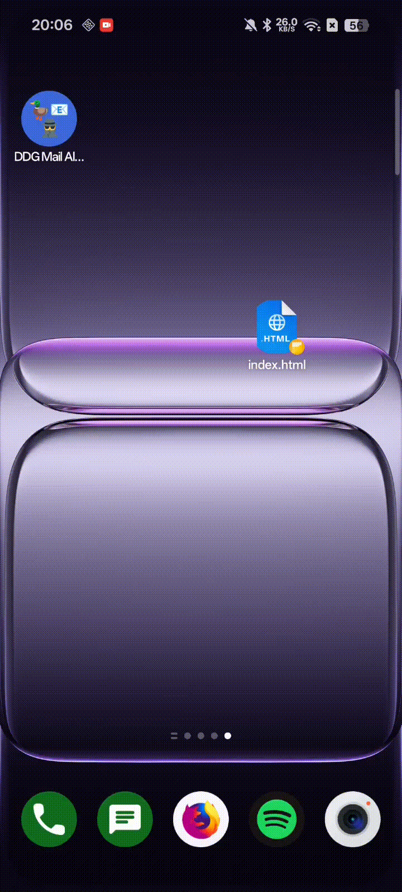
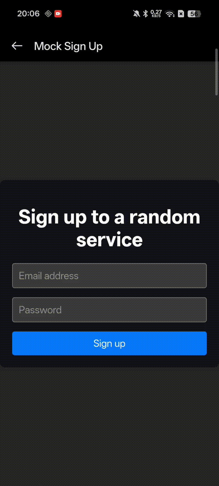

# DDG Mail Alias Generator

A simple Android app that generates DuckDuckGo Mail aliases and copies them to your clipboard. You can generate aliases from within the app or instantly from any screen using the Android Quick Settings tile.

## Features
- Generate DuckDuckGo Mail aliases on demand.
- Quick Settings tile to create and copy a fresh alias without opening the app or leaving the app you are currently in.

## Prerequisites
- Android 12 (API 31) or newer.
- A DuckDuckGo API token (obtainable via for instance this guide by [Bitwarden](https://bitwarden.com/help/generator/#tab-duckduckgo-3Uj911RtQsJD9OAhUuoKrz). Use your preferred method to retrieve the token and paste it into the app.

## Installation
### Install APK
1. Install the latest (pre-)release apk file from the [Releases](https://github.com/yesyesufcurs/DDG-Mail-Alias-Generator-App/releases)

### Build using Android Studio
1. Open the project in Android Studio (tested with Android Studio Panda 4).
2. Compile and run the project on your phone, running it from Android Studio will install the app on the device.

## Usage
1. Paste your DuckDuckGo API token into the "DuckDuckGo API Token" field, this value is persistent and remains after closing the app.
2. Options to generate an alias:
   - In-app: Tap the "Generate Email" button. A DDG email alias will be generated and automatically copied to your clipboard.
     -  
   - Anywhere: Add the DDG Mail Alias Generator Quick Settings tile to your device's quick settings and tap the tile to generate and copy a fresh alias.
     - 

## Warning
Direct API usage is not officially documented by DuckDuckGo and should be used at your own risk.

## Acknowledgements
Special thanks to: [alexboden/ddg-email-generator](https://github.com/alexboden/ddg-email-generator), used as reference for constructing the POST request to generate an email alias.

